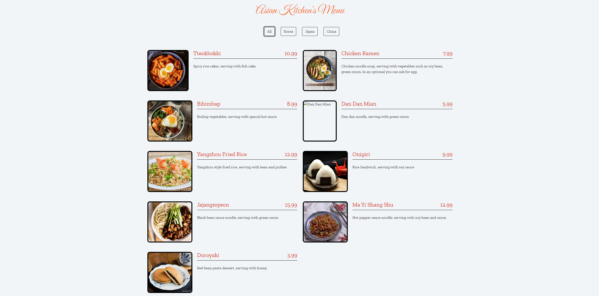

# Asian Kitchen Menu

Bu proje, Asya mutfağından çeşitli yemeklerin sergilendiği bir menü uygulamasıdır. Kullanıcılar, yemekleri kategoriye göre filtreleyebilirler. Proje, HTML, CSS ve JavaScript kullanılarak geliştirilmiştir.

## Özellikler

- Yemeklerin adı, fiyatı, kategorisi ve açıklaması ile birlikte gösterimi.
- Kategorilere göre filtreleme (Tüm, Kore, Japon, Çin).
- Modern ve kullanıcı dostu bir arayüz.

## Teknolojiler

- HTML
- CSS
- JavaScript
- Bootstrap (stilin iyileştirilmesi için)
